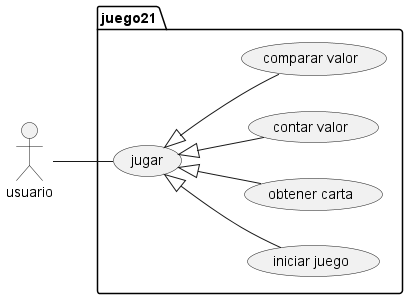

# Ventiuna

El juego de 21 es un juego de cartas, con una o más barajas permite a dos jugadres pedir cartas hasta estar e lo más proximo al valor de 21 sin pasarse.

En esta versión simularemos un 21 se un jugador vs. el repartidor.

El repartidor esatará obligado a pedir cartas hasta igualar al jugador Y solo se plantará cuando lo iguale.

El jugador solo podrá ganar si tuiene mejor puntaje que el repartidor pero sin pasarse de 21.

Las cartas numéricas suman su valor, las figuras como _"J,Q,K"_ Suman 10 y el As vale 1 o 11 segun convenga, solo puede valer 11 si co este valor no excede el valor de 21 de lo contrario solo suma 1.

## Diagramas:
- Diagramas de casos de uso:

- Diagramas de clases:
- Diagramas de secuencia:
